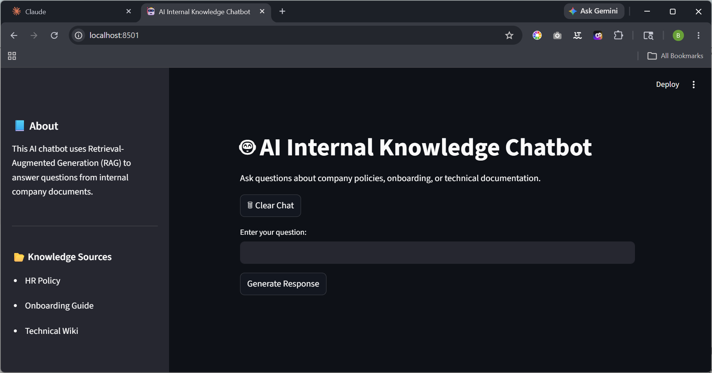
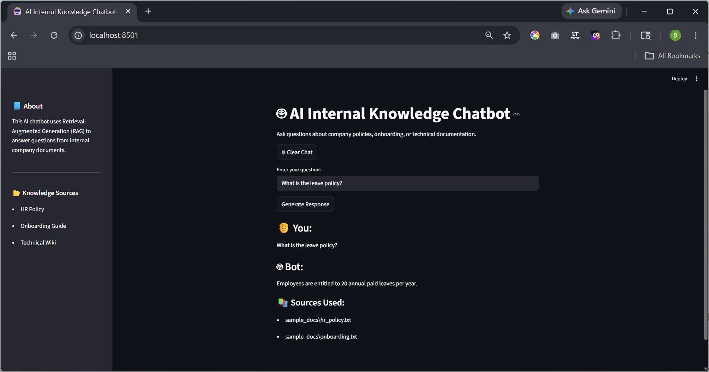
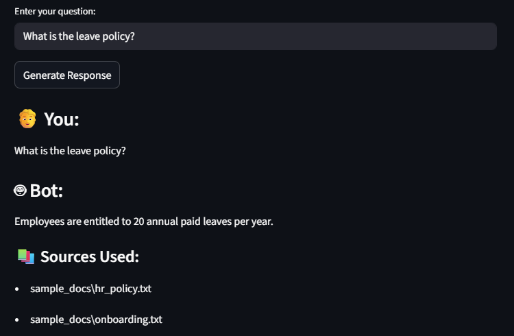
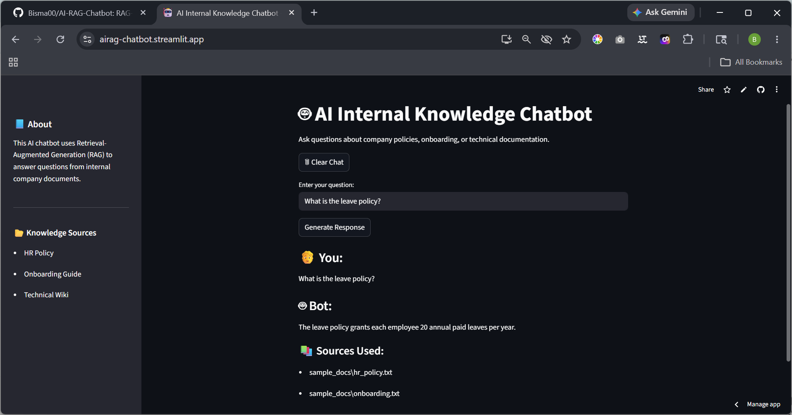

# 🤖 AI-RAG-Chatbot

A professional Retrieval-Augmented Generation (RAG) based chatbot developed for the **Teyzix Core AI Internship Program (AI-2 Task)**.

The system intelligently retrieves information from internal company documents and generates contextual AI-powered responses using Large Language Models (LLMs).

---

## 📌 Project Overview

Organizations store large amounts of internal information across HR policies, onboarding manuals, technical documentation, and internal guides. Employees often spend unnecessary time searching through these documents manually.

This project solves that problem by building an AI-powered internal knowledge assistant capable of:

- Understanding employee queries using Natural Language Processing (NLP)
- Retrieving relevant information from internal documents
- Generating accurate contextual responses using Retrieval-Augmented Generation (RAG)

The chatbot uses semantic search with vector embeddings and FAISS vector database technology to provide fast and relevant answers.

---

## ❗ Problem Statement

Employees frequently struggle to locate relevant information inside internal company documentation. Traditional keyword-based searching is inefficient and time-consuming.

The objective of this project is to build an intelligent AI assistant that can:

- Retrieve relevant information from internal documents
- Understand semantic meaning of queries
- Generate accurate contextual responses
- Improve internal knowledge accessibility and productivity

---

## 🎯 Objectives

The main objectives of this project are:

- Build a complete RAG-based chatbot system
- Implement document ingestion and preprocessing pipeline
- Generate semantic vector embeddings
- Store embeddings using FAISS vector database
- Retrieve relevant contextual information
- Integrate LLM-based response generation
- Develop a professional Streamlit-based UI
- Implement source citation support
- Maintain modular and scalable architecture

---

# 🚀 Features

✅ Document ingestion pipeline  
✅ Text chunking and preprocessing  
✅ Semantic vector embeddings using SentenceTransformers  
✅ FAISS vector database integration  
✅ Context-aware retrieval system  
✅ OpenRouter LLM integration  
✅ Automatic fallback model system  
✅ Streamlit interactive user interface  
✅ Chat history support  
✅ Source citation display  
✅ Modular architecture  
✅ Streamlit Cloud deployment

---

# 🧠 Retrieval-Augmented Generation (RAG)

This project follows the Retrieval-Augmented Generation (RAG) architecture.

Instead of relying only on pre-trained LLM knowledge, the chatbot:

1. Retrieves relevant information from internal documents
2. Adds retrieved context into the prompt
3. Generates responses strictly based on provided documents

This improves:

- accuracy
- contextual relevance
- explainability
- transparency

---

# ⚙️ System Architecture

The application workflow follows these steps:

```text
User Query
    ↓
Streamlit Interface
    ↓
Semantic Retrieval from FAISS
    ↓
Relevant Document Chunks Retrieved
    ↓
Prompt Assembly
    ↓
OpenRouter LLM Response Generation
    ↓
Answer + Source Citations Displayed
```

---

# 🛠️ Technology Stack

| Technology               | Purpose                         |
| ------------------------ | ------------------------------- |
| Python 3.11              | Core programming language       |
| Streamlit                | Frontend web application        |
| SentenceTransformers     | Semantic embeddings             |
| FAISS                    | Vector database                 |
| LangChain                | Document processing             |
| HuggingFace Transformers | NLP framework                   |
| OpenRouter API           | LLM inference                   |
| dotenv                   | Environment variable management |

---

# 📂 Project Structure

```bash
AI-RAG-Chatbot/
│
├── sample_docs/
│   ├── hr_policy.txt
│   ├── onboarding.txt
│   └── technical_wiki.txt
│
├── screenshots/
│   ├── chatbot_interface.png
│   ├── query_handling.png
│   ├── source_citations.png
│   └── streamlit_deployment.png
│
├── vector_store/
│
├── app.py
├── chatbot.py
├── ingestion.py
├── retrieval.py
├── vector_store.py
│
├── requirements.txt
├── .gitignore
├── README.md
└── .env
```

---

# 📄 Internal Documents Used

The chatbot uses sample internal company documents including:

- HR Policy Documents
- Employee Onboarding Guides
- Technical Wiki Documentation

These documents are stored inside the:

```bash
sample_docs/
```

directory.

---

# ⚡ How the System Works

## 1️⃣ Document Ingestion

Documents are loaded from the `sample_docs/` folder using LangChain document loaders.

---

## 2️⃣ Text Chunking

Documents are split into smaller overlapping chunks using:

```python
RecursiveCharacterTextSplitter
```

This improves semantic retrieval accuracy.

---

## 3️⃣ Embedding Generation

Each text chunk is converted into vector embeddings using:

```python
sentence-transformers/all-MiniLM-L6-v2
```

---

## 4️⃣ Vector Database Storage

Generated embeddings are stored inside a FAISS vector database for efficient similarity search.

---

## 5️⃣ Semantic Retrieval

When the user submits a query:

- semantic similarity search is performed
- most relevant chunks are retrieved

---

## 6️⃣ Prompt Assembly

Retrieved context and user query are combined into a structured prompt.

---

## 7️⃣ Response Generation

The prompt is sent to OpenRouter free-tier LLM APIs for AI-generated responses.

The project also includes:
✅ automatic fallback model handling

to improve deployment stability.

---

## 8️⃣ Source Citation Display

The chatbot displays source documents used to generate each answer for transparency and explainability.

---

# 📥 Installation & Setup

## 1️⃣ Clone Repository

```bash
git clone https://github.com/Bisma00/AI-RAG-Chatbot.git
cd AI-RAG-Chatbot
```

---

## 2️⃣ Create Virtual Environment

### Windows

```bash
python -m venv venv
venv\Scripts\activate
```

### Linux / Mac

```bash
python3 -m venv venv
source venv/bin/activate
```

---

## 3️⃣ Install Dependencies

```bash
pip install -r requirements.txt
```

---

# 🔐 Environment Variables

Create a `.env` file in the project root directory:

```env
OPENROUTER_API_KEY=your_api_key_here
```

You can generate an API key from:

[https://openrouter.ai](https://openrouter.ai)

---

# 🧠 Create Vector Database

Run the following command:

```bash
python vector_store.py
```

This process:

- loads documents
- chunks text
- generates embeddings
- creates FAISS vector database

---

# ▶️ Running the Application

Run the Streamlit application locally:

```bash
streamlit run app.py
```

OR

```bash
python -m streamlit run app.py
```

The application will automatically open in your browser.

---

# 🌐 Deployment

The project is deployed using Streamlit Community Cloud.

## 🔗 Live Demo

[https://airag-chatbot.streamlit.app](https://airag-chatbot.streamlit.app)

---

# 💬 Example Queries

```text
What is the company leave policy?
```

```text
Is remote work allowed?
```

```text
What are office timings?
```

```text
What technologies are used by the development team?
```

---

# 📚 Source Citation System

The chatbot includes source citation functionality.

For every generated response, the system displays:

- retrieved document sources
- contextual document references

This improves:

- transparency
- explainability
- trustworthiness

---

# 📸 Screenshots

## 🖥️ Chatbot Interface



---

## 💬 Query Handling



---

## 📚 Source Citations



---

## 🌐 Streamlit Deployment



---

# ⚠️ Challenges Faced

During development, several technical challenges were encountered including:

- OpenRouter free-tier model instability
- Model endpoint availability issues
- Deployment compatibility handling
- Streamlit deployment environment configuration

These issues were resolved by:

- implementing fallback model architecture
- modularizing API handling
- improving deployment reliability

---

# 📈 Future Improvements

Possible future enhancements include:

- PDF and DOCX support
- Multi-user authentication
- Conversation memory
- Voice assistant integration
- Advanced source highlighting
- Docker containerization
- Admin upload panel
- Database-backed document storage

---

# 🎥 Demo Video

The demo video demonstrates:

- document ingestion pipeline
- vector database creation
- semantic retrieval
- query handling
- response generation
- Streamlit deployment walkthrough

---

# 👨‍💻 Author

## Bisma Imran

AI & Machine Learning Intern
Teyzix Core Internship Program
